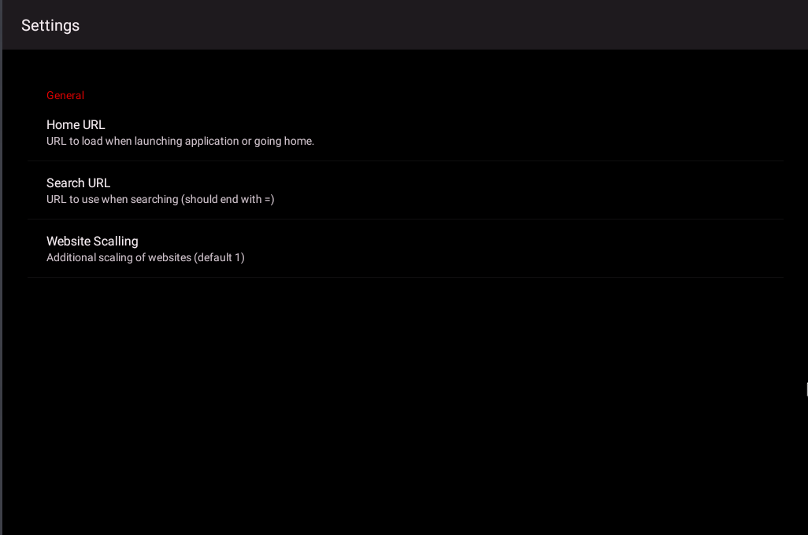

# YoutubeAuto
Youtube and Video player for Android Auto.

It uses libVLC for Android version 3.2.6 so it should be able to play almost all video files.

# IMPORTANT
For this to work you need the followings:
1. Developer mode activated in your Android Auto settings on your Phone
2. Developer mode activated for your Android Auto in your Car (for e.g. CarLink see my [XposedTeyes](https://github.com/pijulius/xposedteyes)) OR just buy an [AAWireless](https://www.aawireless.io) dongle and activate Developer Mode in the AAWireless app

# Thanks to!
1. [YoutubeAuto](https://github.com/hsg210/YoutubeAuto) by @hsg210

2. [libVLC](https://www.videolan.org/vlc/libvlc.html) for Android

3. [Unofficial Android SDK](https://github.com/martoreto/aauto-sdk)
Without this SDK this project wouldn't exist. Thanks to Martoreto for reverse engineering the Waze app and coming up with a easy to use SDK and a sample app.

4. [VideoEnabledWebview](https://github.com/cprcrack/VideoEnabledWebView)
This webview makes fullscreen videos easy to implement.

Without their work this wouldn't be possible!
